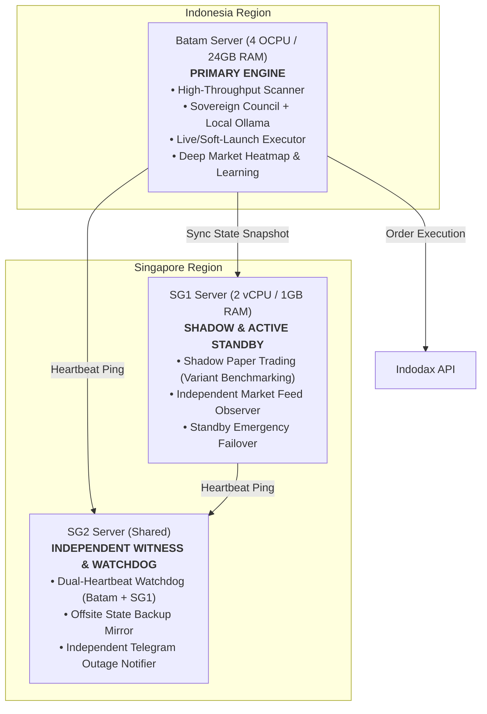

# KiBot Infrastructure Roadmap: 3-Server Architecture

Dokumen ini adalah **rencana strategis arsitektur jangka panjang** yang merinci peta jalan infrastruktur KiBot dari kondisi saat ini (SG1 + SG2) menuju topologi target 3 server begitu server **Batam (4 OCPU / 24GB RAM)** online.

> [!IMPORTANT]
> **DOKUMEN INI BERSIFAT PERENCANAAN MURNI (PLANNING ONLY)**.  
> Tidak ada tindakan migrasi atau provisioning yang dieksekusi sebelum server Batam dinyatakan siap secara fisik dan disetujui oleh operator.

---

## 1. Kondisi Baseline Saat Ini (Current State)

Saat ini seluruh operasional KiBot ditopang oleh 2 instans cloud dengan spesifikasi terbatas:

| Node | Spesifikasi | Lokasi | Peran Saat Ini | Beban & Batasan Kritis |
|---|---|---|---|---|
| **SG1** (`152.69.218.198`) | 2 vCPU / 1GB RAM | Singapore | **Monolitik Produksi**: Scanner, Council, Executor, Dashboard, Daily/Readiness Reporter | RAM 1GB adalah limit fisik absolut. Sudah dioptimasi maksimal (socket timeout, GC tuning, memory leak fix), namun mustahil menjalankan model AI lokal (Ollama) atau pemrosesan kuantitatif berat. |
| **SG2** | Resource terbatas | Singapore | **Eksternal Watchdog & Backup Mirror**; Berbagi host dengan `piyoh-pos` / `piyoh-web` | Menjalankan `scripts/council_watchdog.py` periodik via cron dan mirror git. Tidak boleh dibebani proses trading aktif demi menjaga stabilitas layanan web POS. |

---

## 2. Topologi Target Saat Batam Online (Target State)

Begitu server **Batam** (Oracle Cloud ID / On-Premise: **4 OCPU / 24GB RAM**) aktif kembali, arsitektur monolitik di SG1 akan dipecah menjadi **arsitektur komplementer 3 node**:



### Pembagian Peran Detail:

1. **Batam Server (Primary Compute Hub)**:
   - **Sovereign Council + Local AI (Ollama)**: Kapasitas RAM 24GB memungkinkan model analisis kuantitatif dan LLM lokal berjalan tanpa membebani memori sistem atau bergantung pada API eksternal yang lambat dan berbayar.
   - **High-Throughput Scanner**: Pemindaian orderbook seluruh pasangan Indodax secara instan dengan koneksi berlatensi rendah (domestik Indonesia ke Indodax).
   - **Primary Live / Soft-Launch Executor**: Menjalankan eksekusi orderbook riil dengan proteksi modal `CapitalGovernor`.

2. **SG1 Server (Observer, Shadow Benchmark & Standby Failover)**:
   - **Bukan Dibiarkan Idle**: SG1 dialihkan menjadi **Shadow Engine Khusus**. SG1 menjalankan varian pengujian (`APPROVED`, `CANDIDATE_A`, `BASELINE`) dalam mode paper trading untuk terus menghasilkan data benchmark pembanding tanpa mengganggu CPU/RAM Batam.
   - **Independent Price Feed Observer**: Mengawasi jika terdapat inkonsistensi orderbook atau data feed freeze pada Batam.
   - **Standby Failover**: Menyimpan image runtime cadangan. Jika Batam mengalami pemadaman listrik/internet berkepanjangan, SG1 dapat diaktifkan kembali sebagai operator darurat.

3. **SG2 Server (Independent External Witness)**:
   - **Dual-Heartbeat Watchdog**: Memonitor kesehatan Batam dan SG1 sekaligus dari luar jaringan Batam.
   - **Offsite State Mirroring**: Menerima salinan arsip `state/` (live truth, trade history, decision journal) setiap 6 jam via `rsync` terenkripsi.
   - Jika Batam tidak merespons dalam 3 siklus watchdog berturut-turut, SG2 mengirimkan notifikasi eskalasi kritis ke Telegram operator.

---

## 3. Rencana Migrasi Tanpa Downtime Trading (Zero-Downtime Migration)

Migrasi dari SG1 ke Batam harus dilakukan tanpa adanya celah waktu di mana order menggantung atau posisi tidak terpantau.

### Urutan Tahap Migrasi:

```
[Tahap 1: Provisioning] ──> [Tahap 2: Shadow Mode] ──> [Tahap 3: Handover Window] ──> [Tahap 4: Verification]
```

#### Tahap 1: Setup & Warmup Batam (Tanpa Ganggu SG1)
- [ ] Clone repository KiBot di Batam, siapkan Python venv dan seluruh dependencies.
- [ ] Install unit `systemd` standar (`kibot-scanner`, `kibot-executor`, `kibot-master`, `kibot-dashboard`).
- [ ] Setup `KIBOT_TRADING_MODE=paper` dan `KIBOT_LIVE_TRADING_ENABLED=false` di Batam.
- [ ] Tarik snapshot `state/` terbaru dari SG1 untuk sinkronisasi histori awal.

#### Tahap 2: Shadow Parallel Validation (Durasi: 48–72 Jam)
- [ ] Jalankan scanner dan council di Batam secara paralel dengan SG1.
- [ ] Bandingkan keputusan sinyal antara SG1 dan Batam: pastikan score, confidence, dan pemindaian pair identik.
- [ ] Uji responsivitas jaringan Batam ke endpoint Indodax (cek latensi HTTP/WebSocket).
- [ ] Verifikasi local model Ollama di Batam mampu menyelesaikan evaluasi tanpa lonjakan CPU/RAM berlebih.

#### Tahap 3: Handover Window (Jendela Alih Peran Terkendali)
> Syarat: Dilakukan di luar jam volatilitas ekstrem (misal pukul 03.00 - 04.00 WIB) saat tidak ada posisi aktif, atau seluruh posisi aktif ditutup secara normal terlebih dahulu.

1. **Freeze Scanner SG1**:
   ```bash
   # Di SG1
   bin/kibotctl stop kibot-scanner
   ```
2. **Atomic State Sync**:
   Sinkronkan file state kritis (`state/live_truth.json`, `state/active_trades.json`, `state/trade_history/`) dari SG1 ke Batam via rsync instan.
3. **Stop SG1 Trading Services**:
   ```bash
   # Di SG1
   bin/kibotctl stop kibot-master kibot-executor
   ```
4. **Start Batam Trading Services**:
   ```bash
   # Di Batam
   bin/kibotctl start kibot-scanner kibot-master kibot-executor
   ```
5. **Switch SG1 ke Mode Shadow**:
   Ubah konfigurasi SG1 menjadi penguji varian paper benchmark saja.
6. **Update Watchdog SG2**:
   Arahkan target utama heartbeat `council_watchdog.py` di SG2 ke IP Batam, dengan SG1 sebagai target sekunder.

#### Tahap 4: Verifikasi Pasca Migrasi (Checklist Wajib)
- [ ] `bin/kibotctl status` di Batam menunjukkan semua service `active`.
- [ ] Scanner Batam memancarkan paket UDP sinyal ke port Council (verifikasi via decision journal).
- [ ] `state/decision_journal/` mencatat baris evaluasi baru secara berkala.
- [ ] Heartbeat SG2 mengonfirmasi status Batam `HEALTHY`.
- [ ] Dashboard web di Batam dapat diakses dan menampilkan ekuitas yang valid.

---

## 4. Rollback Plan (Rencana Darurat Jika Migrasi Gagal)

Jika dalam 24 jam pertama pasca-handover terjadi ketidakstabilan di Batam (misal kernel panic, latency spike, atau network dropping):

1. **Hentikan Layanan di Batam**:
   ```bash
   # Di Batam
   bin/kibotctl stop-all
   ```
2. **Tarik State Terakhir dari Batam ke SG1**:
   Ambil delta file `state/` yang terbentuk di Batam kembali ke SG1.
3. **Pulihkan SG1 sebagai Primary**:
   ```bash
   # Di SG1
   bin/kibotctl start-all
   ```
4. **Kirim Notifikasi Insiden**:
   Kirim notifikasi status rollback ke Telegram operator via `sovereign_notifier`.
5. **Audit Masalah**:
   Lakukan investigasi log Batam secara offline tanpa mengganggu operasional trading di SG1.

---

## 5. Analisis: Redundansi Geografis vs Redundansi Fungsional

Berdasarkan pengalaman operasional sepanjang sesi pengembangan:

1. **Pelajaran dari Insiden Masa Lalu**:
   - Server Batam lama pernah mengalami *total outage/disconnection*, yang membuktikan bahwa menggantungkan 100% sistem pada 1 titik fisik (single point of failure) sangat berbahaya bagi dana trading.
   - Di sisi lain, watchdog eksternal di SG2 berulang kali terbukti efektif mendeteksi anomali tanpa ikut tumbang saat host utama mengalami freeze memori.

2. **Rekomendasi Arsitektural**:
   - **Jangan gunakan Active-Active Live Trading**: Menjalankan dua live executor aktif bersamaan di dua server berbeda untuk 1 akun Indodax memicu risiko *race condition*, double buying, atau benturan nonce API.
   - **Gunakan Hybrid Primary-Observer (Fungsional + Geografis)**:
     - **Batam**: Fokus pada keunggulan komputasi (*Fungsional Compute*).
     - **SG1 & SG2**: Menyediakan ketahanan wilayah geografis berbeda (*Geografis SG*). Jika Indonesia/ISP Batam mengalami gangguan kabel laut internasional, SG1 dan SG2 tetap memiliki konektivitas global utuh untuk mengawasi dan mengamankan status akun.

---

## 6. Kesimpulan & Langkah Selanjutnya

Rencana ini siap dieksekusi sewaktu-waktu saat infrastruktur fisik Batam telah aktif dan dapat diakses melalui SSH. Hingga saat itu tiba, **SG1 tetap dipertahankan sebagai host produksi tunggal yang stabil**, dengan seluruh optimasi memori dan proteksi modal yang sudah terbukti andal.
