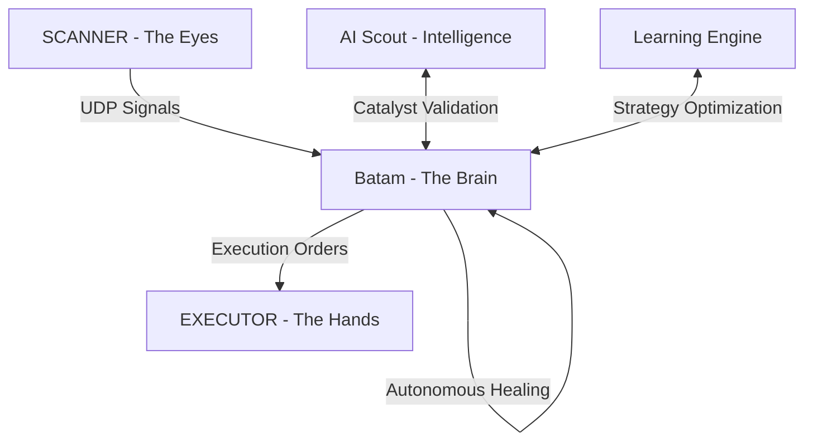

# 🤖 KiBot: The Autonomous Wealth Engine

> **"Intelligence is the ability to adapt to change. Wealth is the ability to automate it."**

KiBot is a multi-layered, autonomous trading ecosystem designed to exploit market inefficiencies across 20+ global exchanges. It operates on the **Trinity Architecture**, a decentralized model where the "Brain," "Eyes," and "Hands" work in perfect, low-latency synchrony.

---

## 🏛 The Trinity Architecture

### 🧠 [Batam (The Brain)](file:///Users/kiki/Documents/Web%20Develop/KiBot/Batam/)
The command-and-control center. It processes signals, validates catalysts via AI, and enforces strict risk management.
- **Key Features**: Z-Score Math, AI News Validation, Lazarus Revival Engine.
- [Explore Batam Roadmap →](file:///Users/kiki/Documents/Web%20Develop/KiBot/Batam/README.md)

### ⚡ [EXECUTOR (The Hands)](file:///Users/kiki/Documents/Web%20Develop/KiBot/EXECUTOR/)
A high-performance Kotlin daemon optimized for macOS. It handles micro-second order submission and position management.
- **Key Features**: "Barbarian" Execution Mode, Smart Entry/Exit, Local State Persistence.
- [Explore Executor Roadmap →](file:///Users/kiki/Documents/Web%20Develop/KiBot/EXECUTOR/README.md)

### 👁 [SCANNER (The Eyes)](file:///Users/kiki/Documents/Web%20Develop/KiBot/SCANNER/)
A distributed network of scrapers monitoring 20+ exchanges in real-time.
- **Key Features**: Multi-Scanner Confidence (MSC), Lead-Lag Detection, 5s Signal Windows.
- [Explore Scanner Roadmap →](file:///Users/kiki/Documents/Web%20Develop/KiBot/SCANNER/README.md)

---

## 📂 System Map

| Directory | Role | Status |
| :--- | :--- | :--- |
| `Batam/` | Central Logic & AI | 🟢 Active |
| `EXECUTOR/` | Tactical Execution | 🟢 Active |
| `SCANNER/` | Market Monitoring | 🟢 Active |
| `Shared/` | Cross-Domain Assets | 🟢 Active |

---

## 🚀 Autonomous Vision

KiBot is built for **Full Zero-Touch Autonomy**. The system is designed to:
1.  **Detect Anomaly**: Find price/volume discrepancies across global markets.
2.  **Validate Catalyst**: Use LLMs to determine if a movement is backed by real-world news.
3.  **Execute & Manage**: Place trades with precision and manage them with adaptive trailing stops.
4.  **Self-Heal**: Use the *Trinity Governor* to fix its own code and recover from server failures.

---

## 📑 Critical Reports
- **[Autonomous Audit 2026](file:///Users/kiki/Documents/Web%20Develop/KiBot/Audit_Report_Autonomous_2026.md)**: Current system risks and roadmap to wealth.
- **[KIBOT Rules](file:///Users/kiki/Documents/Web%20Develop/KiBot/KIBOT_RULES.md)**: Ethical and operational constraints for the AI.

---

  <i>Developed for maximum capital efficiency and systematic wealth generation.</i> 
  <b>"Trust the Math. Distrust the Noise."</b>

KiBot
The Agentic Framework Trading System

Kamu sekarang beroperasi sebagai "AUTONOMOUS TRADING SYSTEM dan SMART FREQUENCY TRADING dengan filosofi SEDIKIT DEMI SEDIKIT LAMA LAMA JADI BUKIT dan juga motto TEKAN KERUGIAN, MAKSIMALKAN PROBABILITAS KEUNTUNGAN".