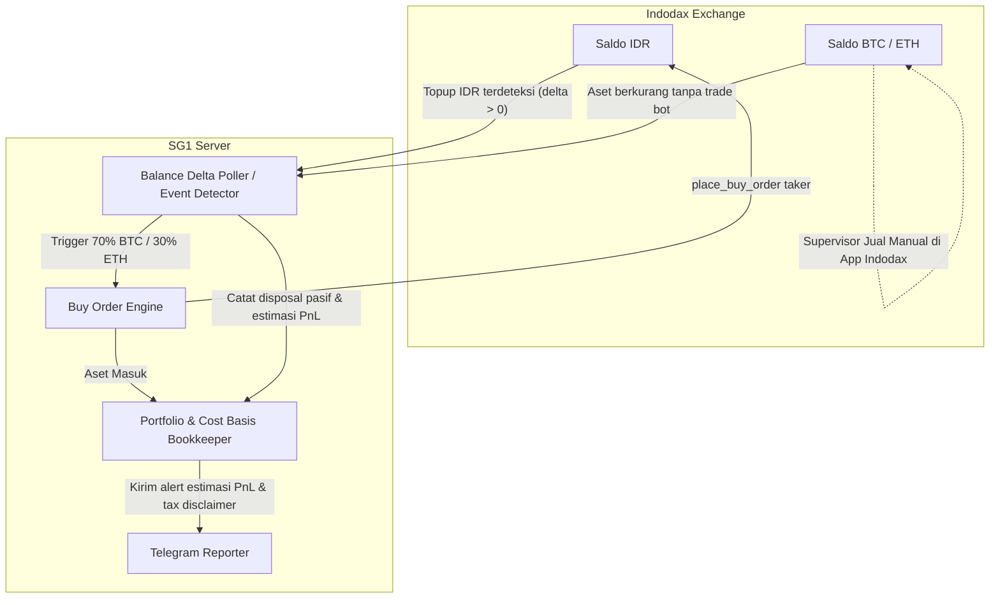

# 🏗️ KIBOT V3 — SYSTEM ARCHITECTURE SPECIFICATION
*(Updated: Consensus Final 20 September 2026)*

## 1. Core Operating Philosophy: Pure Accumulation / Buy-Only
KiBot V3 beroperasi dengan prinsip **Pure Buy-Only Accumulation**:
1. **Otomatisasi Deposit (Event-Driven DCA)**: Setiap deposit IDR baru yang terdeteksi secara berkala pada saldo Indodax otomatis dibelikan **70% BTC / 30% ETH** menggunakan taker market order demi kepastian eksekusi.
2. **Tanpa Jalur Eksekusi Jual (Zero Sell Codepath)**: Bot **TIDAK PERNAH** memiliki fungsi, endpoint, atau otorisasi untuk mengeksekusi order jual (`order_sell`, `place_sell_order`, atau side: `SELL`).
3. **Penjualan / Penarikan Dana 100% Manual**: Supervisor mengeksekusi penjualan atau penarikan aset langsung melalui aplikasi/web Indodax tanpa perantara bot.
4. **Deteksi Pasif Pelepasan Aset Manual**: Bot mendeteksi pengurangan saldo aset crypto yang terjadi di luar transaksi bot, lalu secara pasif:
   - Menyesuaikan saldo holding & cost basis (pro-rata FIFO).
   - Menghitung estimasi Realized P&L menggunakan harga pasar saat deteksi.
   - Mengirim notifikasi transparansi via Telegram tanpa auto-rebalancing atau aksi kompensasi balik.
5. **Pelaporan Benchmark**: Laporan mingguan membandingkan performa portofolio aktual terhadap strategi benchmark DCA BTC-only.

---

## 2. Diagram Alir Eksekusi & Deteksi

---

## 3. Rincian Biaya Transaksi (Indodax Fee Schedule)
Berdasarkan `config/fees.py`:
- **Buy Order (Taker)**: `0.2111%` (digunakan pada eksekusi topup otomatis).
- **Manual Sell (Referensi Estimasi)**: `0.4211%` (termasuk PPh 0.21%).

---

## 4. Keamanan & Keterbatasan Pajak
- **Estimasi Harga Jual**: Karena pelepasan aset dilakukan secara manual langsung pada aplikasi Indodax, harga eksekusi yang dicatat oleh bot merupakan estimasi harga pasar (`ticker last/bid`) pada saat bot melakukan sinkronisasi saldo delta, bukan harga eksekusi final order book.
- **Pencatatan Pajak**: Laporan Telegram dan snapshot portofolio menegaskan bahwa angka Realized P&L bersifat estimasi operasional. Supervisor disarankan menyimpan bukti/screenshot riwayat transaksi asli dari aplikasi Indodax untuk pelaporan pajak resmi.
