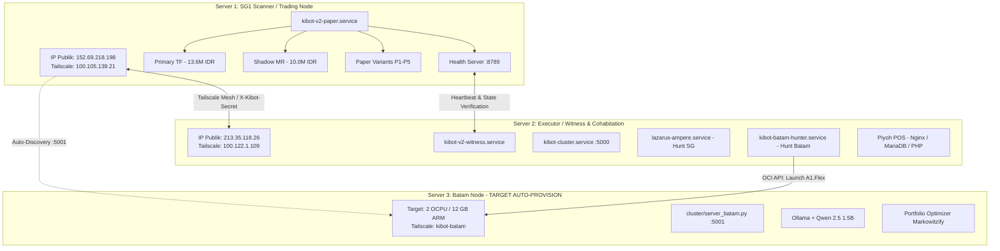

# Arsitektur Cluster KiBot V2 & Rencana Auto-Provisioning Server Batam

Dokumen ini mendefinisikan topologi cluster 2-server aktif saat ini (SG1 dan Server 2), alokasi resource, protokol komunikasi, batasan ketat lingkungan produksi, serta rancangan otomatisasi untuk node ke-3 (Server Batam).

---

## 1. Topologi Cluster Saat Ini & Rencana 3-Node



---

## 2. Resource Budget Per Server

| Parameter | Server 1 (SG1 - Trading) | Server 2 (Executor & Witness) | Server 3 (Batam Target) |
| :--- | :--- | :--- | :--- |
| **Bentuk VM** | `VM.Standard.E2.1.Micro` | `VM.Standard.E2.1.Micro` | `VM.Standard.A1.Flex` |
| **CPU / Core** | 1 OCPU (x86 AMD) | 1 OCPU (x86 AMD) | 2 OCPU (ARM Ampere) |
| **Total RAM** | 1 GB (954 MB) | 1 GB (954 MB) | 12 GB |
| **Swap Disk** | 8.0 GB | 2.0 GB | 4.0 GB |
| **Disk Terpakai** | 20 GB / 48 GB (41%) | 15 GB / 48 GB (31%) | Alokasi 50 GB Boot Volume |
| **Budget RAM Service** | • `kibot-v2-paper`: ~65 MB<br/>• `netdata`: ~50 MB<br/>• `vector`: ~25 MB<br/>• System/SSH: ~100 MB<br/>• Buffer/Growth: ~700 MB | • `kibot-cluster`: ~37 MB<br/>• `kibot-v2-witness`: ~5 MB<br/>• `piyoh-pos-queue`: ~40 MB<br/>• `mariadb` (MariaDB): ~10-145 MB<br/>• `nginx` + `php-fpm`: ~35 MB<br/>• Poller ARM: ~30 MB<br/>• Buffer: ~300 MB | • `server_batam`: ~40 MB<br/>• Ollama (Qwen 1.5B): ~1.8 GB<br/>• Heavy Backtester: ~2.0 GB<br/>• Buffer/Growth: ~8.0 GB |

---

## 3. Aturan Operasional & Batasan Ketat

### ⛔ Server 1 (SG1 Trading Node):
1. **DILARANG** menginstall Ollama, PyTorch, TensorFlow, atau menjalankan model deep learning berat.
2. **DILARANG** menjalankan backtest multi-iterasi atau Monte Carlo simulation.
3. Fokus 100% pada real-time streaming WebSocket (Indodax & Binance), eksekusi order dengan latensi $<5\text{ ms}$, dan perputaran variant paper trade P1–P5.

### ⛔ Server 2 (Executor & Witness):
1. **DILARANG** menjalankan paper trading loop atau engine trading internal di Server 2 untuk menghindari perebutan CPU dan memory dengan **Piyoh POS**.
2. **DILARANG** menghapus direktori `/home/ubuntu/backups/` karena berisi backup database SQL Piyoh POS.
3. **DILARANG** menginstall Ollama di Server 2. Resource hanya cukup untuk witness, cluster API, dan poller ringan (~30MB).

### 🟢 Server 3 (Batam Research Node):
1. Didedikasikan khusus untuk kalkulasi berat: AI sentiment analysis (Ollama Qwen 1.5B), rebalancing portofolio periodik, dan model retraining.
2. Standby failover apabila SG1 mengalami kendala fatal.

---

## 4. Protokol Komunikasi & Keamanan

1. **Zero-Trust Mesh**: Seluruh interaksi lintas server dilakukan melalui jaringan privat Tailscale:
   - SG1: `100.105.139.21`
   - Server 2: `100.122.1.109`
   - Batam: Hostname `kibot-batam`
2. **Autentikasi Cluster**:
   - Header: `X-Kibot-Secret: <KIBOT_CLUSTER_SECRET>`
   - Secret didefinisikan identik di file `.env` masing-masing node dan dimuat sebagai environment variable.
3. **Health Monitoring & Watchdog**:
   - SG1 menyajikan endpoint HTTP lightweight di `http://100.105.139.21:8789/health`.
   - `kibot-v2-witness.service` di Server 2 memantau endpoint tersebut setiap 60 detik. Jika gagal 3 kali berturut-turut, peringatan otomatis dikirimkan ke Telegram.

---

## 5. Alur Otomatisasi Auto-Provisioning Server Batam

```
┌─────────────────────────┐
│ Server 2 Poller Loop    │  Tiap 30 detik: OCI Launch Instance (2 OCPU / 12 GB, ap-batam-1)
└───────────┬─────────────┘
            │ Capacity Available
            ▼
┌─────────────────────────┐
│ Cloud-Init Bootstrap    │  tailscale up --authkey=$TS_KEY, git clone, setup venv, setup systemd
└───────────┬─────────────┘
            │ Boot Selesai (~60-90 detik)
            ▼
┌─────────────────────────┐
│ SG1 Auto-Discovery      │  Ping http://kibot-batam:5001/health via Tailscale MagicDNS
└───────────┬─────────────┘
            │ Node Terdeteksi
            ▼
┌─────────────────────────┐
│ Telegram Notification   │  "🟢 Server Batam aktif! IP: 100.x.x.x, Cluster 3-Node Online"
└─────────────────────────┘
```

---

## 6. Runbook: Pemantauan & Operasi Layanan

### Cek Kesehatan Layanan:
```bash
# Di SG1:
curl -s http://100.105.139.21:8789/health | jq .
systemctl status kibot-v2-paper.service

# Di Server 2:
curl -s -H "X-Kibot-Secret: $KIBOT_CLUSTER_SECRET" http://100.122.1.109:5000/health
systemctl status kibot-v2-witness.service kibot-cluster.service lazarus-ampere.service
```

### Restart Layanan:
```bash
# Restart paper trading di SG1:
sudo systemctl restart kibot-v2-paper.service

# Restart cluster validator di Server 2:
sudo systemctl restart kibot-cluster.service
```
