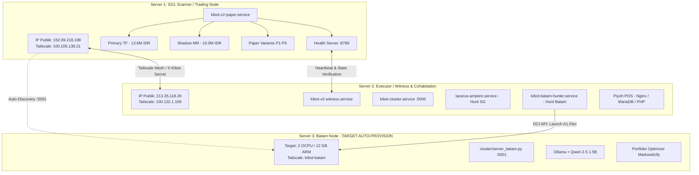

# Arsitektur Cluster KiBot V2 & Rencana Auto-Provisioning Server Batam

Dokumen ini mendefinisikan topologi cluster 2-server aktif saat ini (SG1 dan Server 2), alokasi resource, protokol komunikasi, batasan ketat lingkungan produksi, serta rancangan otomatisasi untuk node ke-3 (Server Batam).

---

## 1. Topologi Cluster Saat Ini & Rencana 3-Node



---

## 2. Resource Budget Per Server

| Parameter | Server 1 (SG1 - Trading) | Server 2 (Executor & Witness) | Server 3 (Batam Target) |
| :--- | :--- | :--- | :--- |
| **Bentuk VM** | `VM.Standard.E2.1.Micro` | `VM.Standard.E2.1.Micro` | `VM.Standard.A1.Flex` |
| **CPU / Core** | 1 OCPU (x86 AMD) | 1 OCPU (x86 AMD) | 2 OCPU (ARM Ampere) |
| **Total RAM** | 1 GB (954 MB) | 1 GB (954 MB) | 12 GB |
| **Swap Disk** | 8.0 GB | 2.0 GB | 4.0 GB |
| **Disk Terpakai** | 20 GB / 48 GB (41%) | 15 GB / 48 GB (31%) | Alokasi 50 GB Boot Volume |
| **Budget RAM Service** | • `kibot-v2-paper`: ~65 MB<br/>• `netdata`: ~50 MB<br/>• `vector`: ~25 MB<br/>• System/SSH: ~100 MB<br/>• Buffer/Growth: ~700 MB | • `kibot-cluster`: ~37 MB<br/>• `kibot-v2-witness`: ~5 MB<br/>• `piyoh-pos-queue`: ~40 MB<br/>• `mariadb` (MariaDB): ~10-145 MB<br/>• `nginx` + `php-fpm`: ~35 MB<br/>• Poller ARM: ~30 MB<br/>• Buffer: ~300 MB | • `server_batam`: ~40 MB<br/>• Ollama (Qwen 1.5B): ~1.8 GB<br/>• Heavy Backtester: ~2.0 GB<br/>• Buffer/Growth: ~8.0 GB |

---

## 3. Aturan Operasional & Batasan Ketat

### ⛔ Server 1 (SG1 Trading Node):
1. **DILARANG** menginstall Ollama, PyTorch, TensorFlow, atau menjalankan model deep learning berat.
2. **DILARANG** menjalankan backtest multi-iterasi atau Monte Carlo simulation.
3. Fokus 100% pada real-time streaming WebSocket (Indodax & Binance), eksekusi order dengan latensi $<5\text{ ms}$, dan perputaran variant paper trade P1–P5.

### ⛔ Server 2 (Executor & Witness):
1. **DILARANG** menjalankan paper trading loop atau engine trading internal di Server 2 untuk menghindari perebutan CPU dan memory dengan **Piyoh POS**.
2. **DILARANG** menghapus direktori `/home/ubuntu/backups/` karena berisi backup database SQL Piyoh POS.
3. **DILARANG** menginstall Ollama di Server 2. Resource hanya cukup untuk witness, cluster API, dan poller ringan (~30MB).

### 🟢 Server 3 (Batam Research Node):
1. Didedikasikan khusus untuk kalkulasi berat: AI sentiment analysis (Ollama Qwen 1.5B), rebalancing portofolio periodik, dan model retraining.
2. Standby failover apabila SG1 mengalami kendala fatal.

---

## 4. Protokol Komunikasi & Keamanan

1. **Zero-Trust Mesh**: Seluruh interaksi lintas server dilakukan melalui jaringan privat Tailscale:
   - SG1: `100.105.139.21`
   - Server 2: `100.122.1.109`
   - Batam: Hostname `kibot-batam`
2. **Autentikasi Cluster**:
   - Header: `X-Kibot-Secret: <KIBOT_CLUSTER_SECRET>`
   - Secret didefinisikan identik di file `.env` masing-masing node dan dimuat sebagai environment variable.
3. **Health Monitoring & Watchdog**:
   - SG1 menyajikan endpoint HTTP lightweight di `http://100.105.139.21:8789/health`.
   - `kibot-v2-witness.service` di Server 2 memantau endpoint tersebut setiap 60 detik. Jika gagal 3 kali berturut-turut, peringatan otomatis dikirimkan ke Telegram.

---

## 5. Alur Otomatisasi Auto-Provisioning Server Batam

```
┌─────────────────────────┐
│ Server 2 Poller Loop    │  Tiap 30 detik: OCI Launch Instance (2 OCPU / 12 GB, ap-batam-1)
└───────────┬─────────────┘
            │ Capacity Available
            ▼
┌─────────────────────────┐
│ Cloud-Init Bootstrap    │  tailscale up --authkey=$TS_KEY, git clone, setup venv, setup systemd
└───────────┬─────────────┘
            │ Boot Selesai (~60-90 detik)
            ▼
┌─────────────────────────┐
│ SG1 Auto-Discovery      │  Ping http://kibot-batam:5001/health via Tailscale MagicDNS
└───────────┬─────────────┘
            │ Node Terdeteksi
            ▼
┌─────────────────────────┐
│ Telegram Notification   │  "🟢 Server Batam aktif! IP: 100.x.x.x, Cluster 3-Node Online"
└─────────────────────────┘
```

---

## 6. Runbook: Pemantauan & Operasi Layanan

### Cek Kesehatan Layanan:
```bash
# Di SG1:
curl -s http://100.105.139.21:8789/health | jq .
systemctl status kibot-v2-paper.service

# Di Server 2:
curl -s -H "X-Kibot-Secret: $KIBOT_CLUSTER_SECRET" http://100.122.1.109:5000/health
systemctl status kibot-v2-witness.service kibot-cluster.service lazarus-ampere.service
```

### Restart Layanan:
```bash
# Restart paper trading di SG1:
sudo systemctl restart kibot-v2-paper.service

# Restart cluster validator di Server 2:
sudo systemctl restart kibot-cluster.service
```

---

## 10. Auto-Provisioning Flow (Step-by-Step)

1. **Hunting Phase (Server 2)**:
   - `kibot-batam-hunter.service` queries OCI Compute API every 35s cycling through Batam Availability Domains (`tIse:AP-BATAM-1-AD-1`).
   - Targets shape `VM.Standard.A1.Flex` (2 OCPU / 12 GB RAM) under compartment `nabillarac23` (`ap-batam-1`).
   - Verifies presence of `TS_AUTHKEY` before executing launch to prevent orphan instance creation.
2. **Launch & Cloud-Init Bootstrap**:
   - Injects `infra/bootstrap-batam.sh` via base64 encoded user_data.
   - Automatically joins Tailscale zero-trust mesh with `--hostname=kibot-batam`.
   - Clones latest repository, builds virtual environment, and installs dependencies.
3. **Cluster Activation**:
   - Enables and starts `kibot-batam-cluster.service` on port `5001`.
   - Signals completion via Telegram alert dispatch with public & Tailscale IPs.
4. **SG1 Auto-Discovery**:
   - `kibot-auto-discovery.service` running on SG1 continuously probes `http://kibot-batam:5001/health`.
   - Once healthy, SG1 transitions internal routing from local fallback mode to Batam offload.

---

## 11. Security & Secret Management (Post-Incident Hardening)

Following the security incident on 2026-09-20 (detailed in [docs/SECURITY_INCIDENT_20260920.md](file:///Users/kiki/Documents/Web%20Develop/KiBot/docs/SECURITY_INCIDENT_20260920.md)):
1. **Strict Credential Segregation**:
   - Secrets are strictly excluded from version control via `.gitignore` (`.env`, `*.env`, `.env.local`, `.env.production`).
   - Injected on host nodes using dedicated environment files (`/home/ubuntu/.kibot-cluster.env` on Server 2, `/home/ubuntu/KiBotV2/.env` on SG1).
2. **Automated Secret Scanning**:
   - Pre-commit Git hook (`scripts/check_secrets.py`) blocks commits containing Telegram Bot token patterns (`\d{10}:[A-Za-z0-9_-]{35}`) or hardcoded `API_KEY`/`SECRET` assignments.
3. **Zero-Trust Network Perimeter**:
   - Inter-node communication (SG1 <-> Server 2 <-> Batam) is strictly restricted to Tailscale IPs (100.x.y.z) and protected by `X-Kibot-Secret` HMAC token validation.
4. **Deadman Switch Scope & Manual Order Isolation**:
   > [!WARNING]
   > **Deadman Switch Scope Notice**: Method `countdownCancelAll` pada Indodax TAPI membatalkan **SEMUA** resting limit order pada pair yang didaftarkan (misal `btcidr`, `ethidr`), termasuk order manual yang dipasang pengguna di akun yang sama. Indodax API tidak mendukung pembatalan berdasarkan tag `clientOrderId` di endpoint deadman. Pastikan Supervisor tidak memasang order limit manual pada pair yang sedang di-trade oleh KiBot saat deadman switch aktif.

---

## 12. Troubleshooting Runbook

### A. Poller Batam Stuck / Error
- **Symptom**: `kibot-batam-hunter.service` stops or logs missing variables.
- **Action**:
  1. Check logs: `sudo journalctl -u kibot-batam-hunter.service -n 25 --no-pager`
  2. Verify `/home/ubuntu/.kibot-cluster.env` contains non-empty `TS_AUTHKEY` and OCI credentials.
  3. Verify OCI connection: `python3 -c "import oci; cfg = oci.config.from_file('~/.oci/config', 'BATAM'); print(oci.identity.IdentityClient(cfg).list_availability_domains(cfg['tenancy']).data)"`
  4. Restart service: `sudo systemctl restart kibot-batam-hunter.service`

### B. Batam Instance Launched tapi Bootstrap Gagal
- **Symptom**: Instance shows running on OCI Console, but `kibot-batam` never appears on Tailscale.
- **Action**:
  1. SSH directly to Batam via its public IP: `ssh -i ~/.ssh/kibot/ssh-key-batam-active.pem ubuntu@<BATAM_PUBLIC_IP>`
  2. Inspect cloud-init log: `sudo tail -n 100 /var/log/kibot_bootstrap.log` or `sudo cat /var/log/cloud-init-output.log`
  3. If Tailscale failed to authenticate, manually join: `sudo tailscale up --authkey=$TS_AUTHKEY --hostname=kibot-batam`
  4. Start cluster service manually: `sudo systemctl status kibot-batam-cluster.service`

### C. Batam Node Unreachable via Tailscale
- **Symptom**: SG1 logs `[AutoDiscovery] Batam not found, using internal fallback`.
- **Action**:
  1. On SG1, test DNS resolution: `ping -c 2 kibot-batam`
  2. Test health port: `curl -m 5 http://kibot-batam:5001/health`
  3. If ping fails, check `tailscale status` on both SG1 and Batam. SG1 automatically continues trading using local fallback algorithms without disruption.

### D. Telegram Bot Token Compromised
- **Symptom**: Unauthorized alert messages, leak alert, or secret scanner warning.
- **Action**:
  1. Immediately revoke existing token via `@BotFather` on Telegram (`/revoke`).
  2. Generate a replacement token.
  3. Update `/home/ubuntu/KiBotV2/.env` on SG1 and `/home/ubuntu/.kibot-cluster.env` on Server 2.
  4. Restart alerts: `sudo systemctl restart kibot-v2-paper.service` on SG1.
  5. Refer to [docs/SECURITY_INCIDENT_20260920.md](file:///Users/kiki/Documents/Web%20Develop/KiBot/docs/SECURITY_INCIDENT_20260920.md).

### E. Deadman Switch Trigger tapi Order Tidak Cancel
- **Symptom**: Bot freeze / shutdown occurs, but open orders remain active on Indodax.
- **Action**:
  1. Trigger manual emergency cancel via Indodax TAPI:
     ```python
     python3 -c "import asyncio; from executor.deadman import cancel_all_if_dead; asyncio.run(cancel_all_if_dead())"
     ```
  2. Check Indodax API keys: verify `INDODAX_API_KEY` and `INDODAX_SECRET_KEY` have trade/cancel permissions.
  3. Inspect logs: `journalctl -u kibot-v2-paper.service -g "[Deadman]"`

---

---

## 13. Current Deployment Summary

Snapshot status per server per audit 2026-09-20:

### A. SG1 — Singapore Trading Node (152.69.218.198 / Tailscale: 100.105.139.21)
- **Role**: Active Trading Node (Paper Trading Multi-Strategy P1-P5 & Trend-Following).
- **Active Services**:
  - `kibot-v2-paper.service`: Running (PID 789601). Memory: ~91MB. External watchdog health port 8789.
  - `kibot-auto-discovery.service`: Running (PID 788187). Polling Batam cluster port 5001 with graceful internal fallback.
- **Resource Usage**:
  - RAM: 605 MB used / 954 MB total (~63% used), Swap: 574 MB used / 8,191 MB total.
  - Disk: 20 GB used / 48 GB total (41% used, 28 GB free).
- **Security Posture**: Tailscale MagicDNS active (`--accept-dns=true`), Indodax Deadman switch active (300s interval, 900s timeout).

### B. Server 2 — Frankfurt Executor & Witness (213.35.118.26 / Tailscale: 100.122.1.109)
- **Role**: Witness Sentinel, Cluster Manager, Batam ARM Poller, and Piyoh POS host (cohabitation).
- **Active Services**:
  - `kibot-cluster.service`: Running (FastAPI cluster coordination on port 5000).
  - `kibot-v2-witness.service`: Running (Independent heartbeat and SG1 health monitor).
  - `kibot-batam-hunter.service`: Standby (Polling OCI Batam every 300s awaiting `TS_AUTHKEY`).
- **Resource Usage**:
  - RAM: 467 MB used / 954 MB total (~49% used), Swap: 380 MB used / 2,047 MB total.
  - Disk: 15 GB used / 48 GB total (31% used, 34 GB free).
- **Security Posture**: File permissions strictly locked (`.kibot-cluster.env`: 600, `batam.pem`: 600).

### C. Batam Node — Target ap-batam-1 (NOT YET PROVISIONED)
- **Role**: Research Node (Heavy Portfolio Optimizer, Regime Simulation & Local LLM).
- **Target Specification**: Shape `VM.Standard.A1.Flex`, 2 OCPU / 12 GB RAM, 50 GB Boot Volume (Oracle Free Tier post-cut rule).
- **Status**: Standby on Server 2 poller. Awaiting Supervisor to insert `TS_AUTHKEY` in `/home/ubuntu/.kibot-cluster.env`.

---

## 14. Auto-Provisioning Timeline & Operational Runbook

### Tahap 1: Pengaktifan Poller (Aksi Supervisor)
1. Supervisor generate Reusable Auth Key di Tailscale Admin.
2. Pasang di `/home/ubuntu/.kibot-cluster.env` Server 2: `TS_AUTHKEY=tskey-auth-...`
3. Restart daemon poller: `sudo systemctl restart kibot-batam-hunter.service`.
4. Poller bertransisi dari standby ke mode hunting aktif: me-request instance ARM 2 OCPU / 12 GB ke OCI API `ap-batam-1` setiap 35-60 detik dengan jitter.

### Tahap 2: Otomatis Dieksekusi Saat Kapasitas Didapat (Cloud-Init `bootstrap-batam.sh`)
1. **OCI Launch**: Instance terbentuk di salah satu Availability Domain Batam.
2. **System Setup**: OS Canonical Ubuntu 24.04 aarch64 mengunduh dependensi (`python3-venv`, `git`, `curl`, `ufw`, `jq`).
3. **Zero-Trust Mesh Join**: Bergabung ke Tailscale secara otomatis menggunakan `$TS_AUTHKEY` dengan hostname `kibot-batam`.
4. **Codebase & Virtualenv**: Repositori di-clone ke `/home/ubuntu/KiBotV2`, virtual environment dibuat, dan dependensi terinstal.
5. **Cluster Service Launch**: Unit `kibot-batam-cluster.service` dibuat dan diluncurkan di port `5001`.
6. **Telegram Notification**: Notifikasi otomatis dikirim ke Supervisor:  
   `🎉 KIBOT BATAM INSTANCE CLAIMED! Shape: 2 OCPU / 12 GB ARM`
7. **Mesh Discovery di SG1**: Service `kibot-auto-discovery.service` di SG1 mendeteksi host `kibot-batam:5001` aktif via Tailscale MagicDNS dan beralih dari internal scoring fallback ke komputasi remote Batam node.

### Tahap 3: Langkah Manual Pasca-Provisioning (Rekomendasi Supervisor)
Setelah notifikasi Telegram masuk bahwa Batam online, jalankan 3 langkah berikut melalui SSH (`ssh -i ~/.ssh/kibot/ssh-key-batam-active.pem ubuntu@kibot-batam`):

1. **Alokasi Swapfile (4GB)**:
   ```bash
   sudo fallocate -l 4G /swapfile && sudo chmod 600 /swapfile && sudo mkswap /swapfile && sudo swapon /swapfile
   echo '/swapfile none swap sw 0 0' | sudo tee -a /etc/fstab
   ```
2. **UFW Port 5001 Lockdown (Tailscale Only)**:
   ```bash
   sudo ufw allow in on tailscale0 to any port 5001 proto tcp
   ```
3. **Instalasi Ollama untuk Local Sentiment Model (Opsional)**:
   ```bash
   curl -fsSL https://ollama.com/install.sh | sh
   ollama pull qwen2.5:3b
   ```


