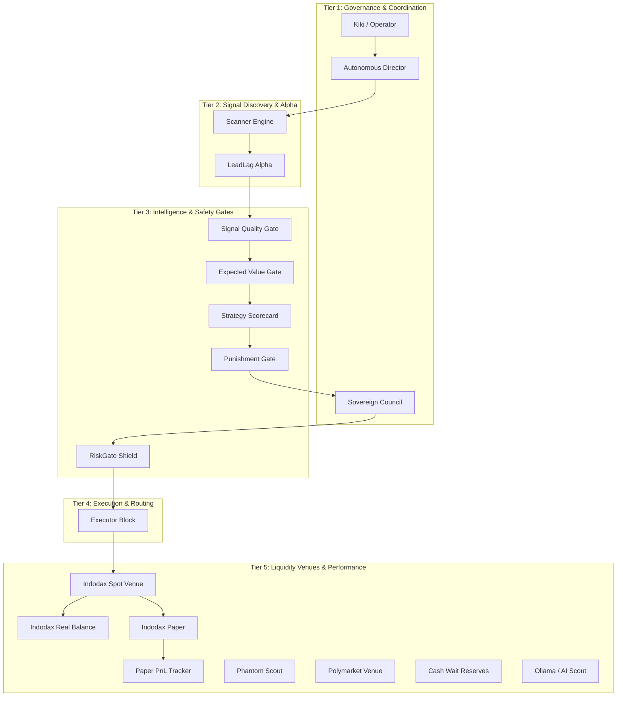

# KiBot Sovereign Dashboard Actor Map

This document establishes the architecture, layout, coordinates, and edge dependencies of the 19 workflow actors that comprise the **KiBot Sovereign Interactive Control Plane Dashboard**.

---

## 🗺️ Architectural Tier Layout (5-Tier Command Chain)

The delegation canvas arranges the 19 workflow actors into five distinct horizontal rows (Tiers), mapping the logical data flow from high-level operator governance down to edge executors and mock/real liquidity pools.

---

## 📊 Complete Registry of the 19 Workflow Actors

| ID | Label | Tier Row | Target Coordinates (X, Y) | Role | Primary Data Responsibility |
|:---|:---|:---|:---|:---|:---|
| **Operator** | Kiki / Operator | Tier 1 | `(150, 100)` | Operator | Dynamic strategy triggers, hard lock intervention |
| **Autonomous Director** | Autonomous Director | Tier 1 | `(450, 100)` | Coordinator | High-level service loop state coordination |
| **Sovereign Council** | Sovereign Council | Tier 1 | `(750, 100)` | Council | Multi-agent consensus validation and trade verdicts |
| **Scanner** | Scanner Engine | Tier 2 | `(150, 280)` | Scanner | Market price, orderbook depth polling |
| **LeadLag Alpha** | LeadLag Alpha | Tier 2 | `(450, 280)` | Alpha | Fast microsecond price lag lead signals detection |
| **Signal Quality** | Signal Quality | Tier 3 | `(150, 460)` | Gate | Noise filtration and price sanity checks |
| **Expected Value** | Expected Value | Tier 3 | `(350, 460)` | Gate | Compiles probability & Kelly fraction checks |
| **Strategy Scorecard** | Strategy Scorecard | Tier 3 | `(550, 460)` | Gate | Score composite rating of signal attributes |
| **Punishment Gate** | Punishment Gate | Tier 3 | `(750, 460)` | Gate | Strikes tracking and quarantine cooldown control |
| **RiskGate Shield** | RiskGate Shield | Tier 3 | `(950, 460)` | Risk Gate | Caps daily drawdowns and limits leverage limits |
| **Executor** | Executor Block | Tier 4 | `(550, 640)` | Executor | Compiles orders and dispatches to exchanges |
| **Indodax Spot** | Indodax Spot Venue | Tier 5 | `(100, 820)` | Venue | Executes crypto spot transactions |
| **Indodax Real Balance** | Indodax Real Balance | Tier 5 | `(250, 820)` | Wallet | Monitors real-money capital (Locked) |
| **Indodax Paper** | Indodax Paper | Tier 5 | `(400, 820)` | Wallet | Monitors simulated paper trading balance |
| **Paper PnL** | Paper PnL Tracker | Tier 5 | `(550, 820)` | Metric | Keeps 24H simulated soak telemetry |
| **Phantom Scout** | Phantom Scout | Tier 5 | `(700, 820)` | Scout | Solana microsecond microstructure discovery |
| **Polymarket** | Polymarket Venue | Tier 5 | `(850, 820)` | Venue | Predicts event probability hedging |
| **Cash Wait** | Cash Wait Reserves | Tier 5 | `(1000, 820)` | Reserve | Holds unused liquidity reserves securely |
| **Ollama / AI Scout** | Ollama / AI Scout | Tier 5 | `(1150, 820)` | Advisory | Local LLM intelligence context parsing |

---

## 🔌 Edge Connector Logic & Visual Classes

The dashboard draws SVG orthogonal connectors with custom color schemes matching service status:
- **Solid Flow Lines:** Heavy active dependencies (e.g. `LeadLag Alpha` -> `Signal Quality`).
- **Dotted Scout Lines:** Intermittent or simulated feed loops (e.g. `Scanner` -> `Phantom Scout`).
- **Active Glows:** Nodes in active evaluation state pulse with a bright neon border.

### Defined Connections (Edges)

1. `Operator` ➔ `Autonomous Director` (Governance)
2. `Autonomous Director` ➔ `Scanner` (Scheduling)
3. `Scanner` ➔ `LeadLag Alpha` (Feed)
4. `LeadLag Alpha` ➔ `Signal Quality` (Filtering)
5. `Signal Quality` ➔ `Expected Value` (EV Compiling)
6. `Expected Value` ➔ `Strategy Scorecard` (Scoring)
7. `Strategy Scorecard` ➔ `Punishment Gate` (Hygiene Check)
8. `Punishment Gate` ➔ `Sovereign Council` (Veto Query)
9. `Sovereign Council` ➔ `RiskGate Shield` (Mandate Compliance)
10. `RiskGate Shield` ➔ `Executor` (Authorization)
11. `Executor` ➔ `Indodax Spot` (Order Dispatch)
12. `Indodax Spot` ➔ `Indodax Real Balance` (Real telemetry, READ ONLY)
13. `Indodax Spot` ➔ `Indodax Paper` (Paper execution loop)
14. `Indodax Paper` ➔ `Paper PnL` (Metrics aggregation)
15. `Scanner` ➔ `Phantom Scout` (Dotted simulation check)
16. `Scanner` ➔ `Polymarket` (Dotted event analysis)
17. `Expected Value` ➔ `Cash Wait` (Dotted reserve management)
18. `Autonomous Director` ➔ `Ollama / AI Scout` (Dotted local LLM advisory)

---
*Certified and compiled for KiBot Autonomous Dashboard v5.*
