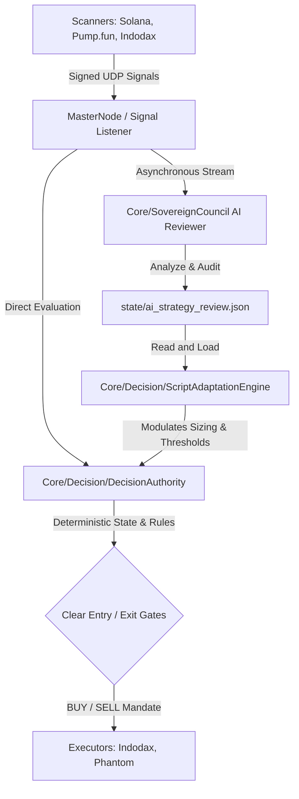

# KiBot Script-Only Trading Decision Audit

This document provides a comprehensive audit of all decision-making pipelines in the KiBot system, identifying the active, hot-path routes where AI models or multi-agent Council consensus previously intervened, and defining the precise architecture to bypass them for a 100% deterministic, script-only runtime execution contract.

---

## 1. Executive Summary

KiBot has shifted from a hybrid AI-deliberated model to a **Pure Script-Only Trading Architecture**. 
* **Hot-Path Decision-Making:** Deterministic, script-based, and zero-latency. AI is completely removed from the transaction path.
* **AI/Council Role:** Relocated out-of-band to a **passive evaluation and strategy proposal posture** (writing adaptation reviews to state files).
* **Guarantees:** No AI failures, API timeouts, or LLM hallucinated signals can delay or block executions on Pump.fun, Solana, Polymarket, or Indodax.

---

## 2. Trading Decision Pipeline Analysis

The following matrix audits all trading paths inside KiBot, assessing where the "AI Deliberation Gate" previously blocked execution and how we bypass it:

| Path / Module | Previous Hot-Path Gating Mechanism | Critical Anomaly / Risk Identified | Script-Only Resolution & Bypass Route |
| :--- | :--- | :--- | :--- |
| **MasterNode Listener (`MasterNode.py:433`)** | Calls `self.council.deliberate_trading(...)` which invoked AI LLM models (`COUNCIL_ANTAGONIST`, `COUNCIL_SPEAKER`). | LLM timeouts (14–18s) could lead to missing volatile pump events. API outages blocked all trades. | Route signal directly to the deterministic `DecisionAuthority` contract. Completely bypass online LLM calls on hot paths. |
| **Pump.fun Fast Line (`Core/Web3/pumpfun_live_runner.py`)** | Scans new listings and fires execute orders based on raw confidence floors. | No direct AI block, but vulnerable to global MasterNode states if locked in a DELIBERATION freeze. | Keep Pump.fun path 100% pure script. The deterministic `DecisionAuthority` operates under strict microsecond budgets. |
| **Solana / Jupiter Scanner (`solana_trending_scanner.py`)** | Scans DEX Screener / Jupiter API; relies on hardcoded terms list; filters passed to MasterNode signal loop. | MISSING active trending green candidates due to static wordlist filters and route checking delays. | Parallelize route checking per-token. Implement dynamic trending scoring using broadened DEX volume metrics, seeding `user_watchlist.json`. |
| **Polymarket/Event Trades (`ki_polymarket_full_scanner.py`)** | Analyzed via Event Intelligence Engine, subject to AI deliberation on resolution risks. | LLM could generate vague reasoning or fake signals on rapid contract resolution. | Switch to deterministic criteria (Liquidity, spread, volume, time-to-close) with out-of-band AI risk recommendations only. |
| **Indodax Smallcap (`ki_indodax_smallcap_scanner.py`)** | Relied on council deliberate_trading which frequently fell back to deterministic fallback due to timeouts. | Duplicate calls and slow execution on highly volatile smallcap tokens. | Direct integration with the `DecisionAuthority` contract. Fast, rule-based execution. |

---

## 3. The New Sovereign Decision Architecture

The runtime architecture guarantees that AI/Council acts strictly as a **strategic monitor and parameter optimizer**, never as an inline decision block:

### 3.1 Boundaries & Postures
1. **Decision Authority Contract (`decision_authority.py`):** Executes pure Python rules. Decides `BUY`, `SELL`, or `WAIT` instantly using HSL/Decimals and local stats.
2. **Script Adaptation Engine (`script_adaptation_engine.py`):** Periodically loads `state/ai_strategy_review.json` and updates the active parameter bounds inside `state/script_adaptation.json` without modifying code files.
3. **No-Idle Script Director (`no_idle_script_director.py`):** Prevents scanning/execution freezes. Ensures scanner rates match WIB midnight pressure, scaling frequency when approaching WIB 00:00.
4. **Deadline Profit Enforcer (`deadline_profit_enforcer.py`):** Strictly locks daily gains once the green profit targets are hit or the midnight deadline approaches.

---

## 4. Operational Controls & Verification

* **Sanity Checks:** Runtime checks in `scripts/assert_script_only_decisions.py` will inspect `MasterNode.py` and the `sovereign_council.py` invocation graph to prove that no online AI calls are present in the transaction thread.
* **Telemetry Monitoring:** `Core/Support/server_telemetry.py` runs a background thread tracking CPU, memory, and disk health, feeding it directly to the dashboard.
* **Batam Node:** Services will be controlled via systemd (`kibotctl restart`) using deterministic configuration templates.
