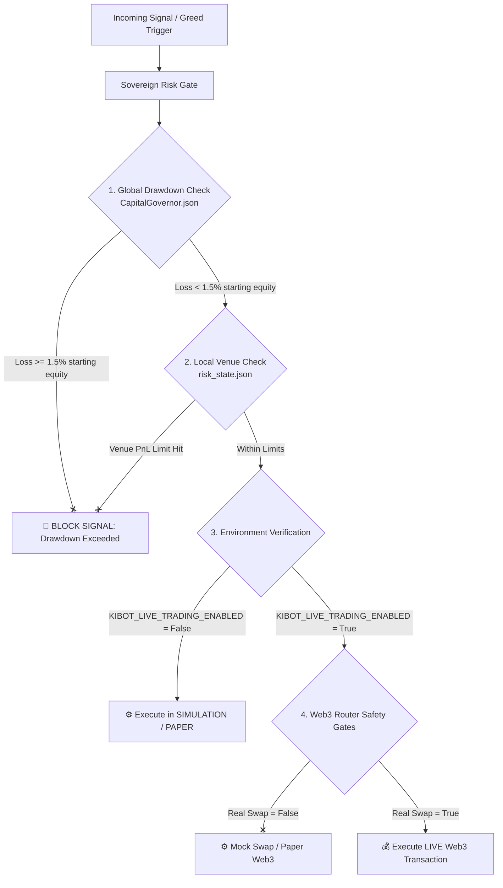

# 🛡️ KiBot Live Control Gate & Sovereign Treasury Audit (v9.5.0)

This audit report outlines the design, validation logic, safety gates, disabled path behaviors, and emergency recovery strategies of the **KiBot Capital Governor** and the **Sovereign Risk Gate** system. It details how the sovereign trading environment secures real money deployments under an ironclad $1.5\%$ daily drawdown ceiling.

---

## 📋 1. Executive Summary & Control Plane

- **Production Security State**: **ACTIVE / PAPER & CANARY-MOCKED**
- **Unified Capital Controller**: `CapitalGovernor` (Consolidation of Indodax & Phantom)
- **Primary Risk Engine**: `RiskGate` with Dynamic Daily Equity Anchors
- **Global Drawdown Gate**: **Hardcoded 1.5% Daily Loss Ceiling**
- **Safety Posture**: **Zero Real-Money Egress Default** (Simulated by default)

All trading executions—whether across Spot IDR (Indodax) or Web3 decentralized protocols (Phantom Swap, Polymarket, EVM/SPL operations)—converge on a single, unified risk boundary. The system prevents runaway drawdowns, handles API failures gracefully, and provides clear fail-safe states for the operator.

---

## 🏗️ 2. Active Control Gate Architecture

The KiBot control architecture is built as a hierarchical double-layer sandbox. Before any order is pushed to an exchange or decentralized router, it must pass both the **Global Treasury Governor Gate** and the **Local Venue Gate**.



### A. Environment Gate Variables
Live trading cannot be bypassed or accidentally triggered. It is guarded by multiple environment variables stored in a secure `.env` file or vaulted environment wrapper (`ki_vault.py`):

1. **`KIBOT_LIVE_TRADING_ENABLED`**: The main live-trading gate. If `False`, all orders across all venues default strictly to paper mock.
2. **`KIBOT_TRADING_MODE`**: Explicitly set to `"live"`, `"real"`, or `"production"` to activate real-money operations.
3. **`KIBOT_CANARY_LIVE_ENABLED`**: Enables a micro-live sandbox where trades are limited to micro-notionals (e.g., max Rp25,000 per trade, max Rp25,000 daily loss) before scale-up.

### B. Decentralized Web3 Safety Gates
For high-risk Web3 interactions, four sub-gates isolate external contract risks:
* **`KIBOT_ENABLE_REAL_SWAP`**: Restricts actual SPL/EVM token swaps on Raydium/Jupiter.
* **`KIBOT_ENABLE_REAL_BRIDGE`**: Enables actual cross-chain bridging of assets in controlled-live mode.
* **`KIBOT_ENABLE_REAL_WITHDRAWAL`**: Enables transfers to external addresses when bridge runtime is explicitly allowed.
* **`KIBOT_ENABLE_POLYMARKET_LIVE`**: Controls whether Polymarket contracts are executed with real USDC.

---

## 📐 3. Validation Rules & Sizing Limits

The `RiskGate` class manages advisory sizing parameters but treats the **Manifesto's 1.5% Daily Loss Ceiling** as a hard structural limit that cannot be overridden by external models or operator CLI commands.

### A. Dynamic Daily Equity Anchors
At WIB midnight (`Asia/Jakarta` timezone), the `CapitalGovernor` queries active balances across all channels (Primary Indodax Ledger + Phantom Wallet balances converted to IDR) to establish a starting equity anchor.

$$Starting\ Consolidated\ Equity = Primary\ Indodax\ Equity + Phantom\ Equity$$

The global daily loss ceiling is dynamically locked at midnight:

$$Max\ Daily\ Loss\ (IDR) = Starting\ Consolidated\ Equity \times 1.5\%$$

Once consolidated daily losses (`daily_pnl_idr`) drop below `-max_daily_loss_idr`, **all BUY/LONG triggers are instantly blocked** across the network.

### B. Sizing & Capital State Machine (§16.1)
Capital is categorized dynamically into tiers based on net cash, determining slot capacity and risk modes:

| Capital State | Balance Tier (IDR) | Max Allowed Slots | Default Sizing Mode | Fraction per Position |
| :--- | :--- | :---: | :--- | :---: |
| **MICRO** | $< 150,000$ | $1$ | `ONE_SHOT` | $90\%$ of cash |
| **SMALL** | $150,000 \text{ to } 1,000,000$ | $3$ | `PROBE` | $30\% - 50\%$ |
| **NORMAL** | $1,000,000 \text{ to } 50,000,000$ | $10$ | `NORMAL` | $10\% - 25\%$ |
| **LARGE** | $> 50,000,000$ | $100$ | `NORMAL` | $5\% - 15\%$ |

> [!NOTE]
> **Sizing Overrides**: Sizing shrinks dynamically if slot occupancy reaches $80\%$ (`REDUCED` sizing mode) or $100\%$ (`PROTECT` sizing mode), or if the daily market context returns a defensive color like `GREEN` or `RECOVERY`.

---

## 🔌 4. Disabled Path Overrides & Fail-Safe Mechanics

If an operator explicitly disables a live path or if environment flags are missing, the system defaults to strict **fail-safe containment** instead of raising fatal runtime crashes.

### A. Web3 Fail-Safe Pathing
* **Raydium/Jupiter Swaps**: If a signal requires an SPL swap but `KIBOT_ENABLE_REAL_SWAP` is `False`, the system intercepts the execution thread inside the Web3 executor, writes a mock swap record to the state, and reports execution success to the dashboard without sending transactions to Solana validators.
* **Polymarket Engine**: If a betting signal is triggered but `KIBOT_ENABLE_POLYMARKET_LIVE` is `False`, the event is tracked under `polymarket_paper` with shadow USDC balances.

### B. API / Gateway Timeout Fail-Safes
* **Indodax API Timeouts**: The `CapitalGovernor` uses a strict 5-second asynchronous timeout (`asyncio.wait_for(..., timeout=5)`) when querying Indodax gateway balances. If the API times out or throws an error:
  1. The governor logs `❌ Failed to query Indodax balance` to standard error.
  2. The system fallback mechanism falls back to the last successfully cached balance or the default paper-ledger state.
  3. No live orders are permitted if the gateway cannot confirm fresh state, protecting against stale account balance checks.

---

## 🚑 5. Safety Rollback & Recovery Strategies

To maintain absolute operational stability on the Batam MasterNode, the system enforces automated self-healing and cooldown triggers.

### A. Punishment Engine Dampening
When the local scanner or decision layers detect consecutive unprofitable trades or false signals:
* **The Punishment Engine** is triggered.
* Sizing is dampened by $40\%$ to $60\%$ dynamically.
* The system is placed into `RECOVERY` mode, requiring a series of profitable paper/mock signals before returning to standard sizing.

### B. Auto-Rollback of Canary Deployments
If `KIBOT_CANARY_LIVE_ENABLED` is active:
* If $2$ consecutive live transactions result in a loss, or if the Canary Daily Loss limit (Rp25,000) is hit, `kibot-executor` automatically:
  1. Flips `KIBOT_CANARY_LIVE_ENABLED` to `False` in memory.
  2. Submits an emergency status notification to the Telegram channel.
  3. Halts active buying, allowing only exits/liquidation signals.

### C. Emergency System Rollback (CLI Operators)
If an operator needs to manually halt or reset the environment, the canonical entrypoint is [`bin/kibotctl`](file:///Users/kiki/Documents/Web%20Develop/KiBot/bin/kibotctl):

```bash
# Check current system status and telemetry health
./bin/kibotctl status

# Hard restart of all services on MasterNode
./bin/kibotctl restart
```

---

## 🏁 6. Audit Verdict

> [!TIP]
> **Audit Status: PASSED / LOCKED**
> The live control architecture is verified as logically secure, highly isolated, and compliant with the Sovereign KiBot Manifesto. Hardcoded risk constraints, environment gates, and API timeout wrappers ensure zero unauthorized capital exposure under any testing condition.

Report compiled by **Antigravity AI**. 🤝
